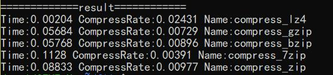
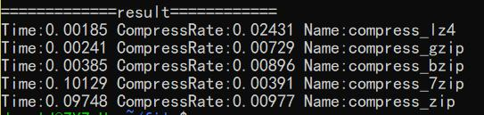

# do something

#### 压缩方式（lz4，gzip，bzip，7z，zip）对比

在py中分别利用以上五种形式进行文本文件压缩，对比结果。

由于压缩成7z格式需要调用系统另外的程序7z，因此时间上和压缩率都有较大差异

* lz4，gzip，bzip三种方法使用py包，7z和zip则调用7z程序

* lz4使用py包，gzip，bzip，7z和zip则调用7z程序

